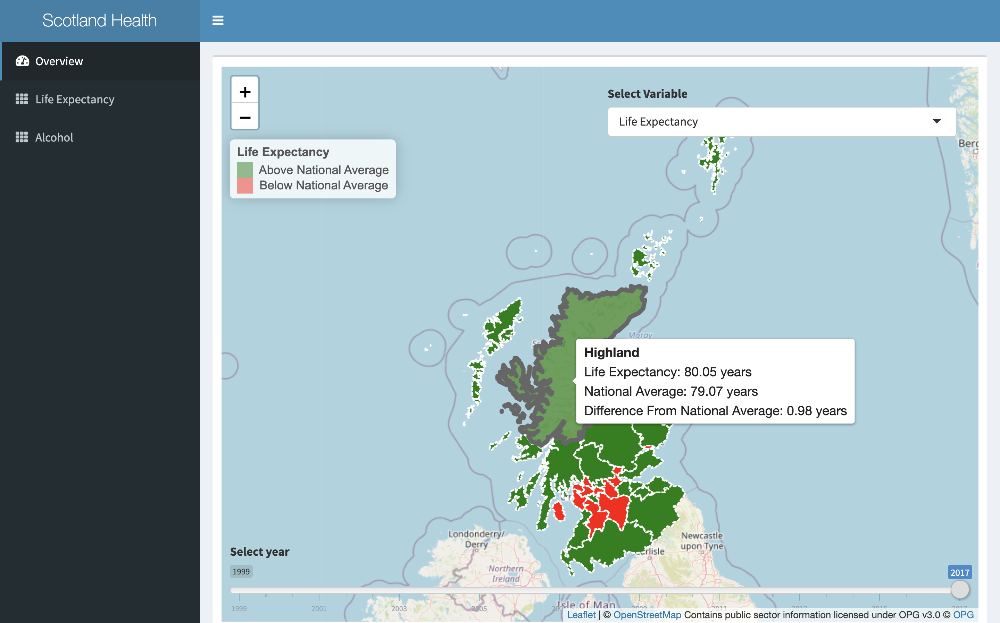
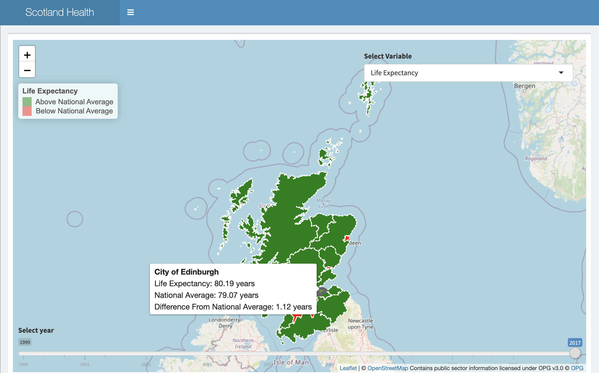
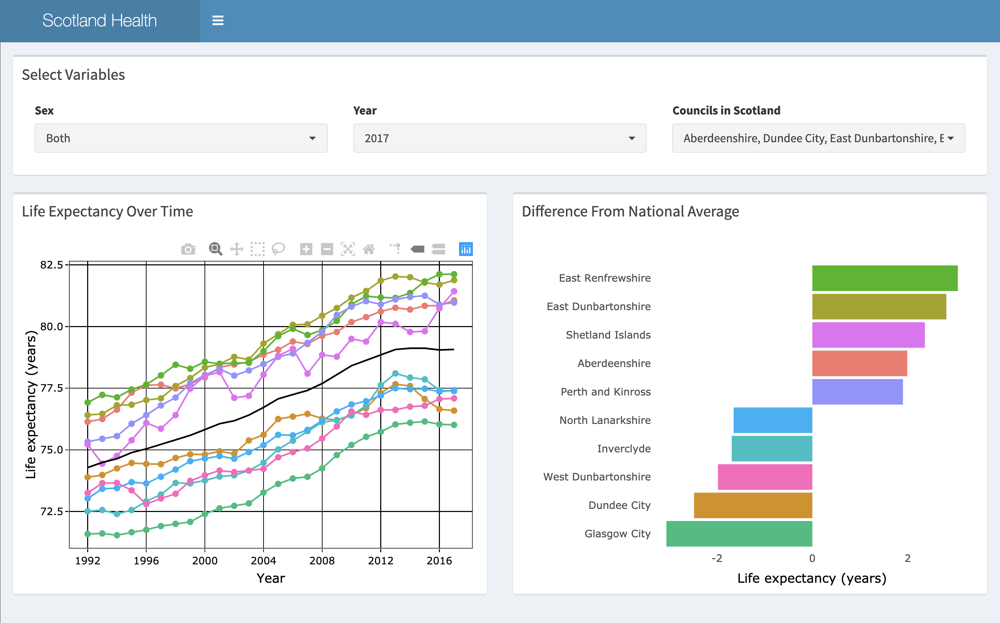
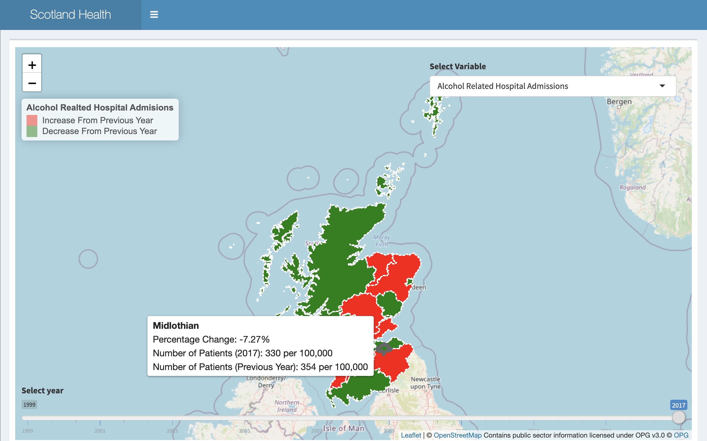
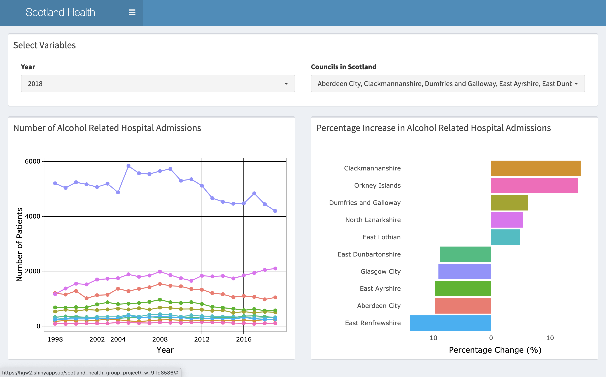

# Scotland Health Project
## Authors
### Harry Williams    
### Ilir Mitrushi    
### Abbygail Utama    
### Grant McGregor 

## App

The app can be found at this [link](https://hgw2.shinyapps.io/scotland_health_group_project/)

## Introduction

Our dashboard landing page displays an [**Interactive map of Scotland**](https://hgw2.shinyapps.io/scotland_health_group_project/) visualising *Life Expectancy at birth* for each Council. In addition, by using colours, it clearly displays if they are below or above Scotland's Life Expectancy at birth.

We use **tabs** to explore **Life Expectancy** and **Alcohol Related Hospital Admissions** dimensions in greater detail. 

The dashboard outlines our health topics from the following perspectives:

**Temporal**: Using Life Expectancy data between 1992 - 2017 we visualise its trend over this period.

**Geographic**: Visualising Life Expectancy at birth  for each council.

**Demographic**: Visualising Life Expectancy at birth by Sex.

These perspectives are **interactive** and can be used for the majority of our dashboard's visual components, i.e. maps, charts, tables etc.

### Stages of the project

-   Assimilating project brief - time spent analysing, discussing and understanding project brief.

-   Data exploration - [<https://statistics.gov.scot>](https://statistics.gov.scot/) the brief specified this site as a primary source but we also conducted a cursory search for other usable relevant sources.

-   Choosing datasets - as a result of our analysis of the brief we focussed on National Records of Scotland (NRS) official Life Expectancy made available publicly. 

-   Planning & dashboard wireframe - Used Trello to help with planning/project management.

-   Git branching & version control-Github - familiarised and explored as the main version control tool for the project.

-   Establish MVP	- Overview of Life Expectancy via geospatial map and drilldown by Life expectancy  and Alcohol related Hosptial Admissions

-   Mob create dashboard skeleton

-   Split into pair groups to work on Overview map, and drill down tabs

-   Regroup to review progress of pair group work

-   Mob solve outstanding issues

-   Project Documentation\

## Contents
 * [Raw data](raw_data) - Raw data sourced from Public Health sites
 
 * [Cleaning script](cleaning_scripts) 

 * [Cleaning scripts](cleaning_script) 

 * [Clean Data](clean_data) 
 * [Overview Functions](overview_functions)
 *  [Life Expectancy map functions](Le_map_functions) 
 *   [Alcohol map functions](alcohol_map_functions) 
 *   [Life expectancy tab functions](life_ex_tab_functions) 
 *   [Alcohol tab functions](alcohol_consumption_functions) 

## Images

 
## Data
#### Data was sourced using open source data found at statistics.scotland.gov. 

### [Life Expectancy](https://statistics.gov.scot/resource?uri=http%3A%2F%2Fstatistics.gov.scot%2Fdata%2FLife-Expectancy)
Life expectancy in years, at birth and for age groups. Breakdowns are also given for deprivation (SIMD) and Urban Rural classification.

Life expectancy refers to the number of years that a person could expect to survive if the current mortality rates for each age group, sex and geographic area remain constant throughout their life. This is referred to as ‘period life expectancy’ and does not usually reflect the actual number of years that a person will survive. This is because it does not take into account changes in health care and other social factors that may occur through someone’s lifetime. However, life expectancy is a useful statistic as it provides a snapshot of the health of a population and allows the identification of inequalities between populations.

### [Alcohol](https://statistics.gov.scot/resource?uri=http%3A%2F%2Fstatistics.gov.scot%2Fdata%2Falcohol-related-hospital-statistics) 
 Alcohol-related hospital statistics (ARHS) provide an annual update to figures on the alcohol-related inpatient and day case activity taking place within general acute hospitals and psychiatric hospitals in Scotland. Ratios presented are European Age-sex Standardised Rates (EASR). All publications and supporting material to this topic area can be found on the ISD Scotland - Drug and Alcohol Misuse Website.. Further open data on this topic is available from the NHS Scotland Open Data website.Hospital activity is data routinely drawn from hospital administrative systems across all NHS hospitals in Scotland. SMR01 (Scottish Morbidity Records 01) is the source for general acute inpatient and day case hospital activity for specialties other than mental health, maternity, neonatal and geriatric long-stay. SMR04 (Scottish Morbidity Records 04) is the source for psychiatric inpatient and day case hospital activity.

## Requirements
Project made in R.  

### Packages

| Package      | Version    
| :------------- | :----------: 
|dplyr|1.0.2|
|DT|0.16
|forcats|0.5.0
|ggplot2|3.3.2 
|leaflet|2.0.3  
|shinyWidgets| 0.5.4  
|lubridate| 1.7.8  
|plotly| 4.9.2.1 
|purrr|0.3.3  
|readr|1.3.1
|sf|0.9-6
|shiny|1.5.0
|shinydashboard|0.7.1 
|stringr|1.4.0 
| tibble|3.0.0 
|tidyr|1.1.2
|tidyverse|1.3.0 

       
